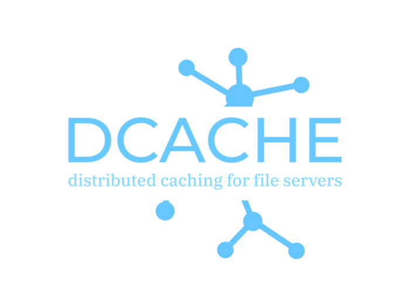

## Distributed Caching Platform for HTTP fileservers.

dcache aims to improve the efficiency and performance of files distribution, it is built to be executed on top of Kubernetes and it can also work with traditional infrastructures as long as multiple nodes and sufficient resources are given to it.

